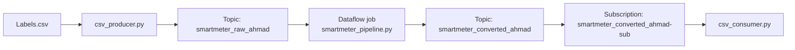

# Milestone 3: Data Processing Service (Design)

**Student:** Ahmad Musleh (101042609)  
**Course:** SOFE4630U, Software Development Methods and Tools

This repository contains the design part of Milestone 3. It adds a **Dataflow streaming job** between the smart meter producer and consumer from Milestone 1. The job reads every reading from Pub/Sub, removes the readings with a missing measurement, converts the units, and sends the result to another Pub/Sub topic.

## Architecture



## Pipeline stages

| Stage | Beam transform | What it does |
|---|---|---|
| `Read from Pub/Sub` | `ReadFromPubSub` | Reads each reading from the input topic as bytes |
| `toDict` | `Map` | Deserializes the bytes (JSON) into a Python dictionary |
| `Filter` | `Filter` | Keeps the reading only if `temperature`, `humidity` and `pressure` are all present (not `None`) |
| `Convert` | `Map` | Pressure: `P(psi) = P(kPa) / 6.895`. Temperature: `T(F) = T(C) * 1.8 + 32` |
| `toBytes` | `Map` | Serializes the dictionary back to JSON bytes |
| `Write to Pub/Sub` | `WriteToPubSub` | Sends the converted reading to the output topic |

`Filter` and `Convert` are Map-style operations: each reading is processed on its own, so Dataflow can process many readings in parallel on its workers. There is no Reduce stage, because the readings do not need to be grouped.

## Files

| File | Description |
|---|---|
| `smartmeter_pipeline.py` | The Dataflow job. The input and output topics are given with `--input` and `--output`. Streaming mode is set inside the script, because Pub/Sub is an unbounded source. |
| `csv_producer.py` | Reads `Labels.csv` row by row, converts the measurements from strings to numbers, replaces missing values with `None` (sent as JSON `null`), and publishes each reading to `smartmeter_raw_ahmad`. |
| `csv_consumer.py` | Subscribes to `smartmeter_converted_ahmad-sub` and prints every converted reading with its units. |
| `Labels.csv` | The smart meter readings from Milestone 1 (100 rows, 22 of them with a missing value). |

## How to run (Cloud Shell)

1. Install Apache Beam and set the variables:
   ```bash
   pip install 'apache-beam[gcp]'
   PROJECT=$(gcloud config list project --format "value(core.project)")
   BUCKET=gs://$PROJECT-ahmad-bucket
   ```
2. Create the topics and the subscription:
   ```bash
   gcloud pubsub topics create smartmeter_raw_ahmad
   gcloud pubsub topics create smartmeter_converted_ahmad
   gcloud pubsub subscriptions create smartmeter_converted_ahmad-sub --topic=smartmeter_converted_ahmad
   ```
3. Start the Dataflow job:
   ```bash
   python smartmeter_pipeline.py \
     --runner DataflowRunner \
     --project $PROJECT \
     --region northamerica-northeast2 \
     --staging_location $BUCKET/staging \
     --temp_location $BUCKET/temp \
     --input projects/$PROJECT/topics/smartmeter_raw_ahmad \
     --output projects/$PROJECT/topics/smartmeter_converted_ahmad \
     --max_num_workers 1 \
     --experiment use_unsupported_python_version \
     --job_name smartmeter-design-ahmad
   ```
4. When the job is running, start the consumer and then the producer in two terminals:
   ```bash
   python csv_consumer.py
   python csv_producer.py
   ```
5. **Cancel the job** when you are done, because a streaming job never stops by itself:
   ```bash
   gcloud dataflow jobs cancel <JOB_ID> --region=northamerica-northeast2
   ```

## Notes

- **Credentials:** the organization policy of the account blocks service account key creation, so the producer and consumer run in Cloud Shell, where the default credentials of the logged-in account are used. If a service account key (`*.json`) is in the folder, the scripts use it instead. Keys are excluded by `.gitignore`.
- **Result:** 22 of the 100 readings have a missing value, so 78 readings reach the consumer. This was checked first by running the same stages locally with the DirectRunner on `Labels.csv`, and then on Dataflow, where the consumer received exactly 78 converted readings.
- **Order:** the readings can arrive at the consumer in a different order, because the job processes them in parallel.
- **Consumer counter:** the Pub/Sub client calls the callback from several threads at the same time. In the first test the printed counter was out of order, so the counter is now updated and printed under a lock.
- **Start order:** the job creates its own subscription on the input topic when it starts, so the producer must be started after the job is running. Readings published before that are not received by the job.
- **Cost:** `--max_num_workers 1` limits autoscaling to one worker, which is enough for this data rate.
